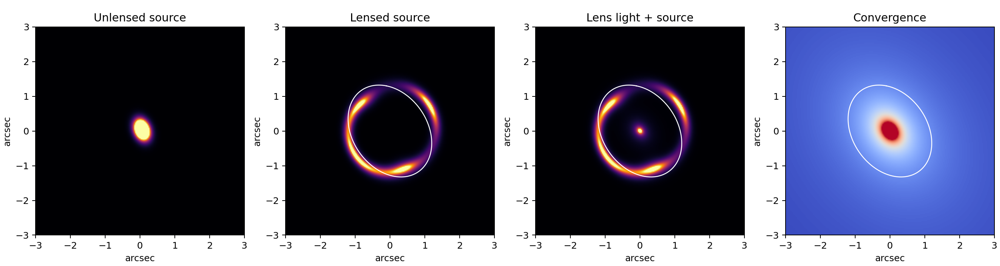
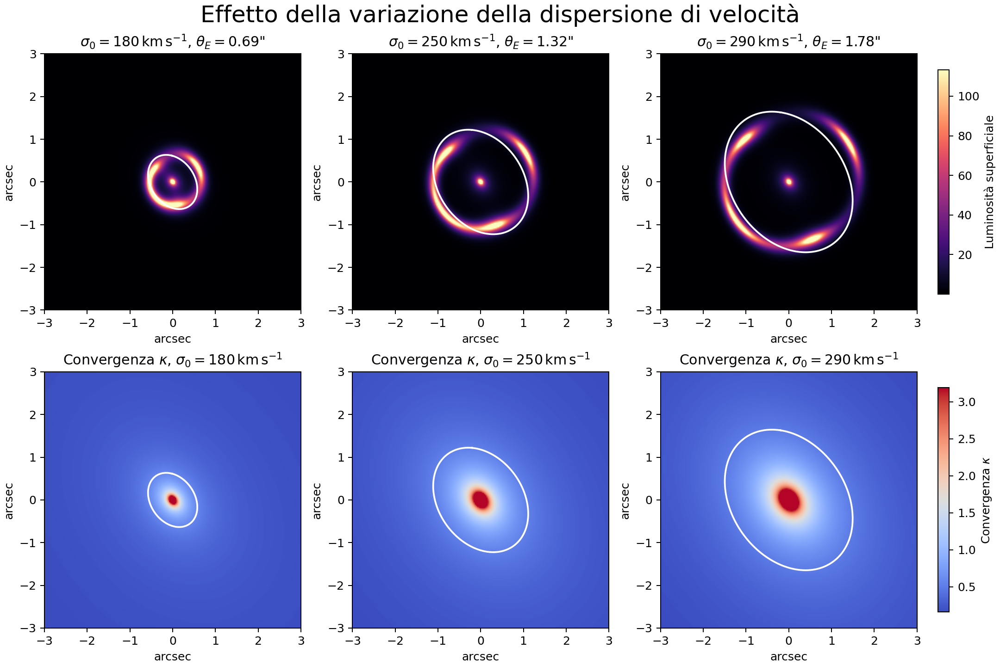
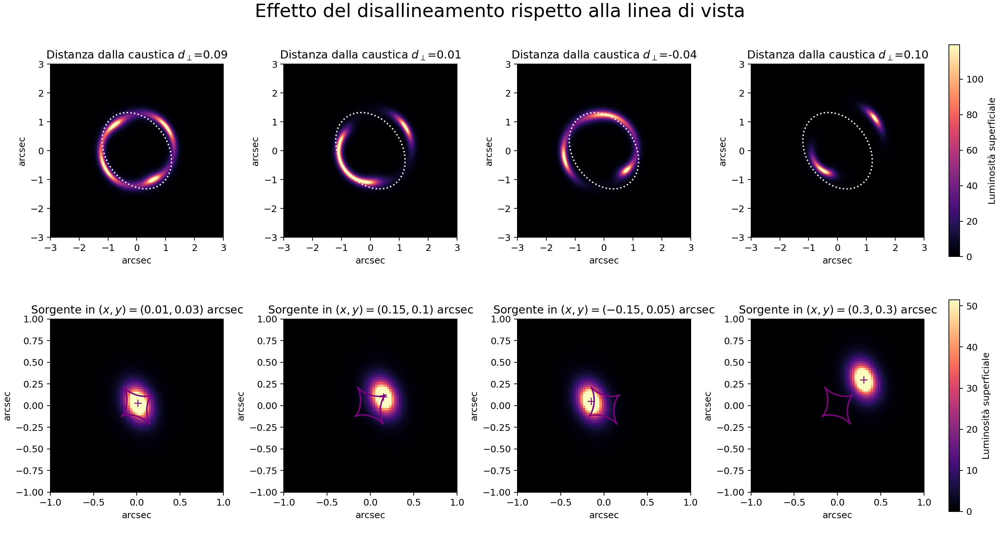
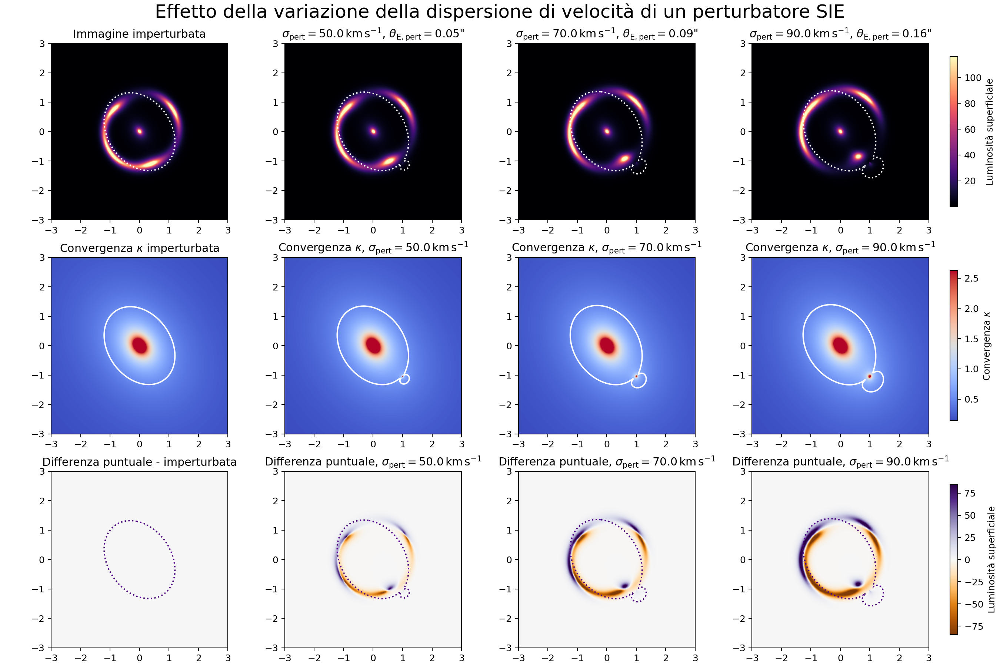
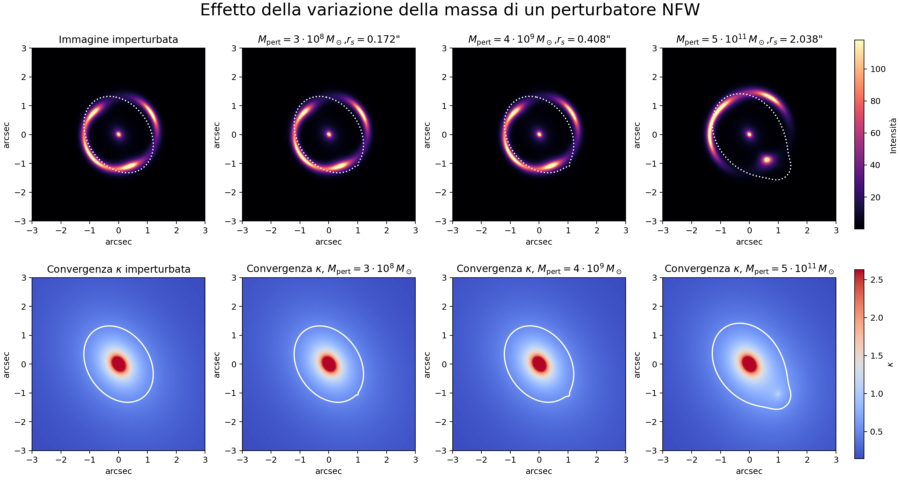

# Dark Matter Studies through Strong Gravitational Lensing

<p align="center">
  
</p>

<p align="center">
  
  
  
  
</p>

**Bachelor's thesis project in Physics at the University of Bologna, investigating how dark matter substructures can affect strong gravitational lensing observables through numerical simulations.**

> **Scientific question:** *Can strong gravitational lensing reveal the presence and properties of dark matter substructures on sub-galactic scales?*

This repository contains the thesis manuscript, simulation notebooks, generated figures, and supporting material developed for the study of dark matter substructures through strong gravitational lensing.

The project combines a theoretical study of dark matter and gravitational lensing with numerical simulations performed using **PyLensLib**, focusing on how different lens configurations and dark matter perturbers modify observable lensing signatures.

> **Language note:** the thesis manuscript is written in **Italian**; the simulation code and this documentation are in **English**.

---

## Table of Contents

- [Scientific Context](#scientific-context)
- [Thesis](#thesis)
- [Project Overview](#project-overview)
- [Repository Structure](#repository-structure)
- [Notebooks](#notebooks)
- [Simulations](#simulations)
- [Software & Requirements](#software--requirements)
- [Quick Start](#quick-start)
- [Example Outputs](#example-outputs)
- [Results](#results)
- [Thesis Manuscript](#thesis-manuscript)
- [Citation](#citation)
- [Author & Acknowledgements](#author--acknowledgements)
- [License](#license)

---

## Scientific Context

Strong gravitational lensing provides a powerful way to probe the distribution of matter in and around galaxies. Small-scale perturbations in lensed images can offer indirect evidence for dark matter substructures that are otherwise difficult to observe.

This project investigates these effects through simulated galaxy-galaxy lensing systems, comparing different lens configurations and perturber models, and focuses on the observable consequences of dark matter perturbers:

* image morphology
* surface-brightness perturbations
* residual structures
* flux-ratio anomalies
* detectability as a function of perturber properties

---

## Thesis

| | |
|---|---|
| **Title** | *Studio della Materia Oscura tramite Strong Gravitational Lensing* |
| **Author** | Sabrina Notarpietro |
| **Supervisor** | Prof. Giulia Despali |
| **Institution** | Alma Mater Studiorum – University of Bologna |
| **Academic Year** | 2025–2026 |

**Topics covered:** the ΛCDM cosmological model · observational evidence for dark matter · strong gravitational lensing theory · detection of dark matter subhaloes through lensing · simulated lensing systems with and without perturbing substructures · comparison between SIE and NFW perturbers · observable signatures and detectability of dark matter substructures.

---

## Project Overview

The project has two complementary components:

**Theoretical background** — ΛCDM cosmology, dark matter phenomenology, gravitational lensing theory, strong-lensing observables, dark matter subhaloes and their detection, current observational constraints from the literature.

**Numerical simulations** — galaxy-galaxy strong lensing systems, source-lens alignment, variations in primary lens parameters, dark matter substructure perturbations, SIE and NFW perturber models, residual and flux-ratio diagnostics.

---

## Repository Structure

```text
bachelor-thesis/
│
├── notebooks/
│   ├── first_lensing_simulation.ipynb
│   ├── lensing_simulation.ipynb
│   └── immagine_scattering.ipynb
│
├── outputs/
│   └── Generated figures and simulation products
│
├── pyLensLib-master/
│   └── PyLensLib source code
│
├── Scrittura/
│   └── Overleaf project and thesis manuscript
│
└── README.md
```

---

## Notebooks

### [`first_lensing_simulation.ipynb`](notebooks/first_lensing_simulation.ipynb)

Introductory notebook demonstrating the basic workflow of a strong gravitational lensing simulation: an SIE primary lens, a Sérsic source galaxy, a lens-galaxy light component, critical-curve computation, optional secondary mass components, SIE and NFW perturbations, residual-image analysis, and flux/detectability diagnostics.

### [`lensing_simulation.ipynb`](notebooks/lensing_simulation.ipynb)

Main simulation notebook used to generate the figures in **Chapter 4** of the thesis, organized into four studies:

1. **Velocity dispersion variations** — Einstein-radius evolution, critical-curve modifications, convergence maps, changes in image morphology.
2. **Source-lens misalignment** — Einstein rings, arc formation, multiple-image configurations, caustic structures.
3. **SIE perturbers** — perturber velocity dispersion, surface-brightness perturbations, residual maps, flux-ratio variations, detectability thresholds.
4. **NFW perturbers** — halo-mass variations, convergence maps, residual imaging, flux-ratio variations, detectability thresholds.

### [`immagine_scattering.ipynb`](notebooks/immagine_scattering.ipynb)

Utility notebook used to generate the schematic figure illustrating gravitational light deflection.

---

## Simulations

The simulations assume a **flat ΛCDM cosmology** and model the lensing system using a galaxy-scale SIE primary lens, Sérsic profiles for the source and lens light, and ray tracing through PyLensLib.

| Parameter            | Investigated effect                                 |
| --------------------- | ---------------------------------------------------- |
| Primary lens mass     | Changes in Einstein radius and image configuration   |
| Velocity dispersion   | Changes in lensing strength and critical curves      |
| Source position       | Changes in arcs, rings, and multiple images          |
| Perturber properties  | Changes in image morphology and residuals            |
| Perturber profile     | Comparison between SIE and NFW models                |

---

## Software & Requirements

Recommended environment: **Python 3.10+**

Dependencies:

```text
numpy
matplotlib
astropy
jupyter
PyLensLib
```

**PyLensLib** models gravitational lenses, computes deflection fields, generates critical curves and caustics, performs ray tracing, and simulates lensed galaxy images. It must be available in your Python environment (see the [PyLensLib repository](https://maxmen.github.io/pyLensLib/) for installation — it is not distributed via PyPI).

Install the standard dependencies with:

```bash
pip install numpy matplotlib astropy jupyter
```

---

## Quick Start

```bash
git clone https://github.com/Nsab04/bachelor-thesis.git
cd bachelor-thesis
pip install numpy matplotlib astropy jupyter   # see Software & Requirements for PyLensLib
jupyter notebook
```

Then open `notebooks/lensing_simulation.ipynb` and run the cells to reproduce the simulations. Generated figures and simulation products are saved to `outputs/`.

---

## Example Outputs

### Velocity Dispersion Variations
<p align="center"></p>

*Simulated lensing configurations obtained by varying the velocity dispersion of the primary lens.*

### Source-Lens Misalignment
<p align="center"></p>

*Lensing configurations obtained by varying the source position relative to the lens.*

### SIE Perturbers
<p align="center"></p>

*Simulated effects of SIE dark matter perturbers on the lensed surface-brightness distribution.*

### NFW Perturbers
<p align="center"></p>

*Simulated effects of NFW dark matter perturbers with different halo properties.*

---

## Results

The simulations produce a range of observables used to characterize the effects of dark matter substructures: lensed images, convergence maps, critical curves, caustics, residual maps, flux-ratio measurements, and detectability diagnostics.

Most figures in `outputs/` correspond to the numerical analysis presented in **Chapter 4** of the thesis, illustrating how the presence and properties of dark matter perturbers modify the observable structure of strongly lensed images — providing a framework for studying their potential detectability.

---

## Thesis Manuscript

The complete thesis manuscript is written in Italian and is contained in [`Scrittura/`](Scrittura/). For the theoretical background, derivations, literature review, and detailed discussion of the numerical results, refer to the thesis.

---

## Citation

If you use material from this repository, please cite:

> Sabrina Notarpietro, *Studio della Materia Oscura tramite Strong Gravitational Lensing*, Bachelor's Thesis, University of Bologna, 2025–2026.

---

## Author & Acknowledgements

**Author:** Sabrina Notarpietro — University of Bologna
**Supervisor:** Prof. Giulia Despali

This work was developed as part of a Bachelor's Thesis in Physics. Special thanks to **Massimo Meneghetti** for developing **PyLensLib**, the software library used throughout this project.

---

## License

This repository uses two licenses, covering different kinds of content:

* **Code written by the author** (`notebooks/lensing_simulation.ipynb`, `notebooks/immagine_scattering.ipynb`, and any custom scripts outside `pyLensLib-master/`) is released under the **[MIT License](LICENSE)**. You are free to use, modify, and redistribute it, including for commercial purposes, provided the original copyright notice is retained.
* **Manuscript and figures** (thesis text and all images under `outputs/` and `Scrittura/`) are released under **[CC BY-NC 4.0](https://creativecommons.org/licenses/by-nc/4.0/)**. You may share and adapt this material with attribution, for non-commercial purposes only.

**`notebooks/first_lensing_simulation.ipynb`** was written by the thesis supervisor, **Prof. Giulia Despali**, and is **not** covered by the MIT license above — it is included for reference and reproducibility with her permission. All rights to that file remain with her; contact her directly for any reuse.

**PyLensLib** (in `pyLensLib-master/`) is third-party software with its own license — refer to that directory for terms; it is not covered by the licenses above.

If you use or adapt any part of this work, please cite the thesis as shown in [Citation](#citation).
