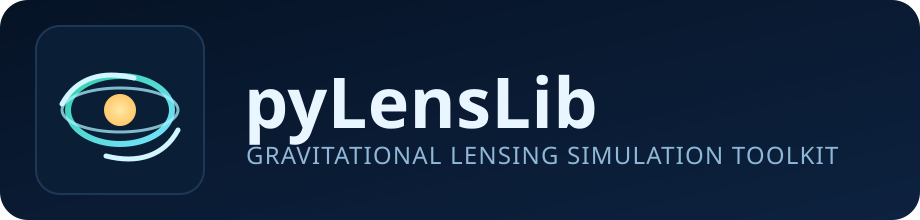

# pyLensLib



`pyLensLib` is a scientific Python package for simulating gravitational lensing
across multiple scales:

- microlensing
- galaxy-scale lensing
- cluster-scale strong lensing (including GGSL-oriented workflows)

The package combines analytical lens/source models with map-based deflectors,
ray tracing tools, observational effects, and utility modules for simulation
pipelines.

## Features

- Analytical lens mass models (`piemd`, `sie`, `epl`, `pepl`, `nfwell`, `extshear`)
- Map-based deflectors from precomputed deflection-angle grids (`deflector`)
- Mass-map ray tracing with legacy potential-FFT and direct/adaptive FFT
  convergence-to-deflection backends (`raytracer`, `convergence_integrals`)
- Source models (`sersic`, `sersic_numba`, `pointsrc`, shapelet variants), with optional time-delay-surface refinement for point-source image positions (`pointsrc(refine_to_td=True)`)
- Critical lines and caustics utilities (`critcau`, methods in `genlen`)
- Multi-plane propagation and ray tracing (`multiplane`, `raytracer`, `raymesh`)
- Observation/instrument modeling (`observation`)
- Lenstool interface helpers (`lenstool`)

## Package Structure

The documentation and API are organized into these groups:

1. Core Foundations
2. Lens Mass Models
3. Source and Light Models
4. Ray Tracing and Multi-Plane Propagation
5. Simulation Utilities
6. Catalogs, Populations, and External Data
7. Observation and Instrument Effects
8. Interactive Tools

## Installation

### Basic install (package only)

```bash
pip install .
```

### Editable install (recommended for development)

```bash
pip install -e .
```

### Install with project dependencies

```bash
pip install -r requirements.txt
```

## Minimal Usage Example

```python
import numpy as np
from astropy.cosmology import FlatLambdaCDM

from pyLensLib.deflector import deflector
from pyLensLib.sersic import sersic

# Cosmology
co = FlatLambdaCDM(H0=70.0, Om0=0.3)

# Dummy deflection-angle maps (no-lensing toy setup)
n = 128
angx = np.zeros((n, n))
angy = np.zeros((n, n))

# Build deflector and lens-plane grid
gl = deflector(co, angx=angx, angy=angy, zl=0.3, zs=1.0)
theta = np.linspace(-20.0, 20.0, n)
gl.setGrid(theta=theta)

# Build lensed source
src = sersic(
    size=40.0,
    Npix=n,
    gl=gl,
    n=2.0,
    re=1.0,
    flux=1e3,
    ys1=0.0,
    ys2=0.0,
    zs=1.0,
)

image = src.image
```

## Mass Maps to Deflection Maps

`raytracer` can derive deflection-angle maps from a projected mass map. The
constructor keeps the historical backend as the default:

```python
from pyLensLib.raytracer import raytracer

rt = raytracer(
    co,
    mass_map,       # Msun per pixel
    Nray=2048,
    FOVray=200.0,  # arcsec
    fromfile=False,
    zl=zl,
    zs=zs,
    fov=400.0,     # mass-map field of view in arcsec
    method="deflection_fft",
)
```

Available methods:

- `method="potential_fft"`: legacy pyLensLib path. It pads `kappa`, solves for
  the lensing potential with a Fourier Poisson solver, interpolates the
  potential to the ray grid, then differentiates it to obtain `a1/a2`.
- `method="deflection_fft"`: direct convergence-to-deflection FFT convolution.
  It computes `a1/a2` from the standard finite-map lensing integral and computes
  the potential separately with a logarithmic Green's-function convolution.
- `method="deflection_fft_adaptive"`: split-resolution approximation to the
  direct FFT method. Near-field mass is handled on the high-resolution grid and
  far-field mass on a downsampled grid. Validate this mode against
  `deflection_fft` for critical lines, caustics, and cross sections before using
  it for production measurements.

The direct FFT methods and lower-level helpers live in
`pyLensLib.convergence_integrals`.

## Documentation

Published documentation is available at:

https://maxmen.github.io/pyLensLib/

Sphinx documentation sources are available in the `docs/` folder.

Build locally:

```bash
PYTHONPATH=$(pwd) make -C docs clean html
```

Generated HTML entry point:

`docs/_build/html/index.html`

## Examples and Validation Scripts

- `Test/` contains many end-to-end scripts and notebooks.
- `Test/test_compare_massMapSPH_internal.py` compares `massMapSPH()` with the
  internal SPH map builder. Use `--kernel-internal wendland_c2` to test the
  opt-in Wendland-C2 deposition kernel against the default cubic-spline path;
  the Wendland-C2 support defaults to the SWIFT/SWIFTSIMIO value
  `--kernel-gamma-internal 1.936492`. In synthetic mode, the default
  `--synthetic-sampling components` samples compact subhalos separately so
  their critical lines are not washed out by under-sampling of the combined
  mass map; use `--synthetic-sampling composite` for the older behavior. Use
  `--synthetic-internal-split-components` to smooth the main halo and subhalo
  particles in separate SPH passes, which keeps the large-scale critical line
  smooth while preserving compact subhalo critical lines.
- `Test/test_compare_snapshot_deflection_fft_modes.py` compares
  `potential_fft`, `deflection_fft`, and `deflection_fft_adaptive` on a snapshot
  mass map, writing JSON metrics plus summary and critical-line plots.
- `apps/` contains additional workflows and utilities.

## Optional/Feature-Specific Dependencies

Some modules need additional libraries:

- `g3read`: cluster/subfind workflows
- `py-sphviewer` or `py-sphviewer2`: optional external backends for
  `cluster.massMapSPH()`. pyLensLib first tries the legacy
  `sphviewer.tools.QuickView` path, then the compatible `sphviewer2` API; if
  neither is available, it falls back to `cluster.massMapSPH_internal()`.
- `geopandas`: optional geometry backend for random-point sampling inside
  caustics and `genlen.select_points_in_caustics()`
- `PyQt6`, `PyYAML`: Qt interactive interface (`lens_interact_qt`)
- `lenstronomy`: optional point-source image solving backend
- `pyLensLib.sedcompat`: internal SED and passband utilities (replaces external `barak.sed`)

If you use those modules, ensure the relevant dependencies are installed.

## License

This project is distributed under the MIT License (see `LICENSE`).
